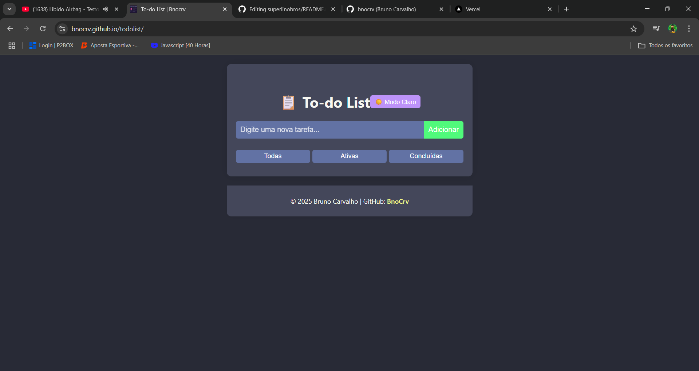

# ✅ To Do List

To Do List é uma aplicação web de lista de tarefas, desenvolvida com HTML, CSS e JavaScript puro. O objetivo principal foi colocar em prática conceitos de lógica de programação, manipulação de DOM, controle de estado e experiência do usuário.

O projeto simula uma lista de tarefas tradicional, com funcionalidades essenciais como adição, marcação e remoção de tarefas, além de um sistema de tema claro/escuro com a paleta de cores **Dracula**.

[🔗 Acesse o projeto](https://bnocrv.github.io/todolist/)

---

---

# 📝 Funcionalidades principais

- Adicionar novas tarefas
- Marcar tarefas como **concluídas**
- Remover tarefas da lista
- Filtro por status: todas, concluídas, pendentes
- Alternar entre **modo claro** e **modo escuro**
- Armazenamento local usando `localStorage` (tarefas persistem ao recarregar a página)
- Interface responsiva, adaptada para mobile e desktop
- Design com base na paleta de cores **Dracula**

---

# 📷 Screenshot

---

# 💾 Instalação

O projeto possui uma versão instalável como PWA (Progressive Web App). Você pode instalá-lo diretamente pelo navegador em dispositivos compatíveis. O arquivo `manifest.json` foi configurado para essa finalidade.

---

# 🧠 Conceitos e tecnologias aplicadas

- HTML5 semântico
- CSS3 com uso de variáveis para facilitar a troca de tema
- JavaScript (vanilla) para manipulação de tarefas e DOM
- Uso de `localStorage` para armazenamento persistente
- Tema dinâmico controlado via `toggle` (modo claro/escuro)
- Implementação de PWA com `manifest.json` e `serviceWorker`

---

# 🧪 Melhorias futuras

- Animações para transições de tema e tarefas
- Opção de edição de tarefas já criadas
- Integração com Firebase ou IndexedDB para sincronização entre dispositivos
- Notificações personalizadas com lembretes

---

# 👨‍💻 Sobre

Este projeto foi desenvolvido como parte dos meus estudos em Análise e Desenvolvimento de Sistemas (ADS), com o intuito de praticar conceitos fundamentais de front-end, usabilidade e controle de dados no navegador. Além disso, busquei explorar a construção de aplicações mais completas, mesmo com tecnologias básicas.

---

# 📫 Contato

- GitHub: [@bnocrv](https://github.com/bnocrv)  
- LinkedIn: [@bnocrv](https://linkedin.com/in/bnocrv)
